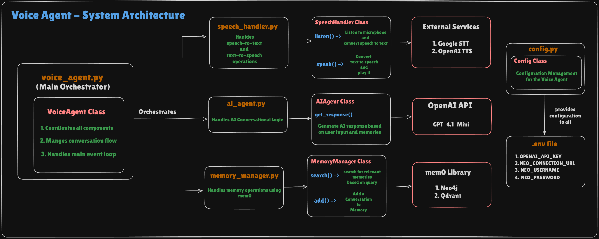
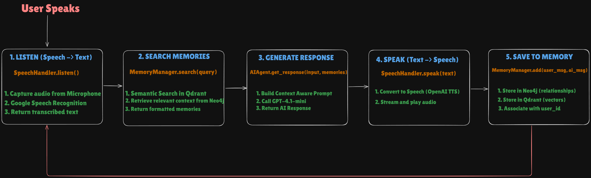

# Conversational Voice AI Agent

A sophisticated voice-powered AI assistant that combines speech recognition, natural language processing, and memory management to create context-aware conversational experiences.

## System Architecture



The system consists of four main components:
- **voice_agent.py**: Main orchestrator that coordinates all components
- **speech_handler.py**: Handles speech-to-text (STT) and text-to-speech (TTS) operations
- **ai_agent.py**: Manages AI conversational logic using OpenAI GPT models
- **memory_manager.py**: Handles memory operations using mem0 with Neo4j and Qdrant

## Data Flow



The conversation flow follows these steps:
1. **Listen**: Capture audio from microphone and convert to text using Google Speech Recognition
2. **Search Memories**: Perform semantic search in Qdrant to retrieve relevant context from Neo4j
3. **Generate Response**: Build context-aware prompt and call GPT-4.1-mini for AI response
4. **Speak**: Convert text to speech using OpenAI TTS and stream audio playback
5. **Save to Memory**: Store conversation in Neo4j (relationships) and Qdrant (vectors)

## Features

- **Voice Input/Output**: Natural speech interaction using Google STT and OpenAI TTS
- **Context-Aware Conversations**: Maintains conversation history and user context
- **Semantic Memory Search**: Retrieves relevant past conversations using vector similarity
- **Graph-Based Memory**: Stores relationships between conversations in Neo4j
- **Async Audio Streaming**: Real-time audio playback for responsive interactions
- **Configurable Voice**: Uses OpenAI's "coral" voice with cheerful personality

## Tech Stack

- **Speech Recognition**: Python SpeechRecognition Package
- **Text-to-Speech**: OpenAI TTS (gpt-4o-mini-tts)
- **AI Model**: OpenAI GPT-4.1-mini
- **Memory Framework**: mem0ai
- **Vector Database**: Qdrant
- **Graph Database**: Neo4j
- **Embeddings**: OpenAI text-embedding-3-small

## Customization

### Change User ID
```python
assistant = VoiceAgent(user_id="YourName")
```

### Modify TTS Voice
Edit `speech_handler.py`:
```python
voice="coral"  # Options: alloy, echo, fable, onyx, nova, shimmer, coral
```

### Adjust AI Personality
Edit the system prompt in `ai_agent.py` to customize the assistant's behavior.

## Troubleshooting

- **Microphone not detected**: Check PyAudio installation and microphone permissions
- **Neo4j connection error**: Verify Neo4j is running and credentials are correct
- **Qdrant connection error**: Ensure Qdrant is running on localhost:6333
- **OpenAI API error**: Verify API key and check rate limits

## License

This project is licensed under the MIT License - see the [LICENSE](LICENSE) file for details.

## Contributing

Contributions are welcome! Please feel free to submit a Pull Request.

## Acknowledgments

- [OpenAI](https://platform.openai.com/docs/guides/voice-agents) for GPT and TTS APIs
- [mem0ai](https://docs.mem0.ai/introduction) for memory management framework
- [Neo4j](https://neo4j.com/docs/) for graph database
- [Qdrant](https://qdrant.tech/documentation/) for vector search capabilities
